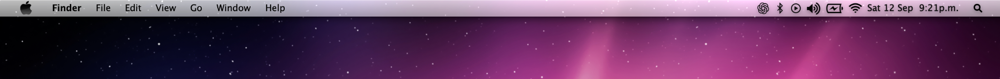
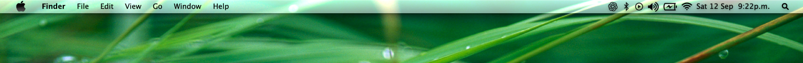

# Snow Leopard Menu Bar Tweak

A Snow Leopard-inspired menu bar for **macOS Sequoia**.

[English](#english) · [Español](#español)

## Screenshots / Capturas






---

## English

### What it changes

- Snow Leopard-style translucent menu bar
- Wallpaper-aware menu-bar appearance
- Classic blue menu and contextual-menu selections
- Snow Leopard-style status icons
- Classic source-list/sidebar selections in supported apps

### Requirements

- **macOS Sequoia 15.x**
- **Apple Silicon**
- **Ammonia** installed and working

### Install

The easiest option is to download the latest **`.pkg` from GitHub Releases** and open it with macOS Installer.

The prebuilt package does **not** require Xcode or Command Line Tools on the Mac where it is installed. Ammonia must already be installed.

### Build the `.pkg` yourself

Clone or download the repository, then run:

```bash
./Build-Package.command
```

The finished package will be created in `dist/`.

Building from source requires Xcode Command Line Tools:

```bash
xcode-select --install
```

You can also build and install directly from source with `Install.command`.

### Uninstall

Open:

```text
Uninstall.command
```

This removes the tweak components installed by this project. It does not remove Ammonia.

### Notes

This project uses private macOS behavior, so major macOS updates may require changes to the tweak.

For development, manual installation, architecture, and other technical details, see [`docs/`](docs/README.md).

### License

MIT. See [`LICENSE`](LICENSE).

---

## Español

Tweak inspirado en la barra de menús de **Mac OS X Snow Leopard** para macOS Sequoia.

### Qué cambia

- Barra de menús translúcida estilo Snow Leopard
- Apariencia adaptada al wallpaper
- Selecciones azules clásicas en menús y menús contextuales
- Iconos de estado estilo Snow Leopard
- Selecciones clásicas en sidebars/source lists de apps compatibles

### Requisitos

- **macOS Sequoia 15.x**
- **Apple Silicon**
- **Ammonia** instalado y funcionando

### Instalación

La opción más sencilla es descargar el **`.pkg` más reciente desde GitHub Releases** y abrirlo con Installer de macOS.

El paquete precompilado **no necesita Xcode ni Command Line Tools** en el Mac donde se instala. Ammonia debe estar instalado previamente.

### Compilar el `.pkg`

Clona o descarga el repositorio y ejecuta:

```bash
./Build-Package.command
```

El paquete terminado se creará dentro de `dist/`.

Para compilar desde el código fuente sí necesitas Xcode Command Line Tools:

```bash
xcode-select --install
```

También puedes compilar e instalar directamente desde el código fuente usando `Install.command`.

### Desinstalación

Abre:

```text
Uninstall.command
```

Esto elimina los componentes instalados por el proyecto, pero no elimina Ammonia.

### Notas

El proyecto utiliza comportamiento privado de macOS, por lo que una actualización importante del sistema puede requerir cambios en el tweak.

Para instalación manual, desarrollo, arquitectura y detalles técnicos consulta [`docs/`](docs/README.md).

### Licencia

MIT. Consulta [`LICENSE`](LICENSE).
