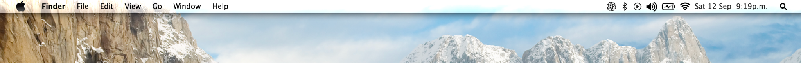
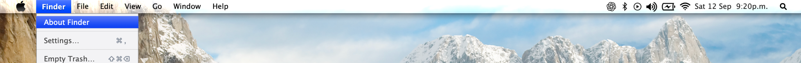

# Snow Leopard Menu Bar Tweak

A Snow Leopard-inspired menu bar and menu selection tweak for **macOS Sequoia 15.x** on Apple Silicon.





## What it changes

- Snow Leopard-style menu bar appearance
- Classic popup/context menu shape and shadow
- Blue menu and sidebar selections
- Snow Leopard-style submenu arrows
- Classic status/menu bar icons

The project uses two separate runtime components:

- `libSnowLeopardMenuBarUnified.dylib` — menu bar, popup menus and status items
- `libSnowLeopardBlueSelection.dylib` — menu, Dock and sidebar selection visuals

## Requirements

- macOS Sequoia **15.x**
- Apple Silicon
- Ammonia installed and working

## Install

For a normal release, install the `.pkg` from GitHub Releases.

To build and install from source:

```bash
./Install.sh
```

Xcode Command Line Tools are required when building from source.

## Uninstall

```bash
./Uninstall.sh
```

## Build

```bash
make all
make test
```

Create a package:

```bash
make package
```

Run the final repository/release checks:

```bash
make release-check
```

## Documentation

Developer and technical documentation is in [`docs/`](docs/README.md).

## Notes

This project uses private macOS APIs and runtime injection. System updates can change internal AppKit behavior, so test new macOS releases before installing.

The tweak does **not** require Glow.

## License

Code is released under the MIT License. See [`LICENSE`](LICENSE). Artwork or reference material may have separate rights.

---

## Español

Tweak inspirado en **Mac OS X Snow Leopard** para macOS Sequoia 15.x en Apple Silicon.

### Qué modifica

- apariencia clásica de la barra de menús
- forma y sombra de menús emergentes/contextuales
- selección azul en menús y sidebars
- flechas de submenu estilo Snow Leopard
- iconos clásicos de la barra de menús

### Requisitos

- macOS Sequoia **15.x**
- Apple Silicon
- Ammonia instalado y funcionando

### Instalar desde source

```bash
./Install.sh
```

### Desinstalar

```bash
./Uninstall.sh
```

La documentación técnica está en [`docs/`](docs/README.md). El proyecto no depende de Glow.
